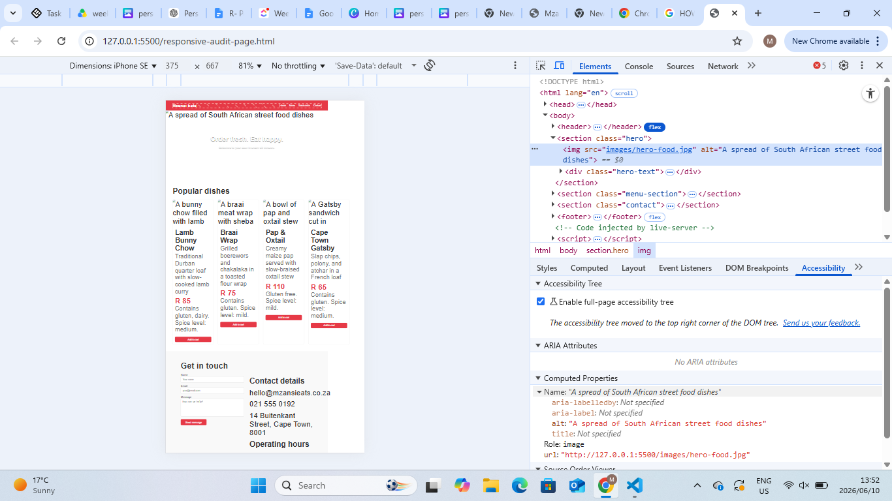
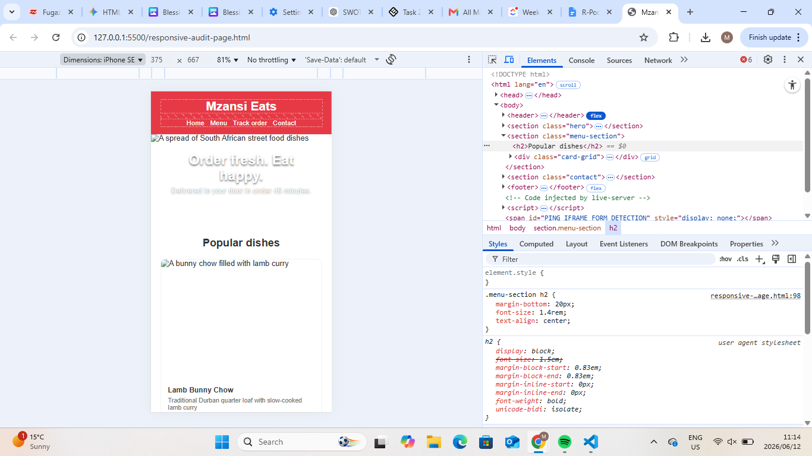
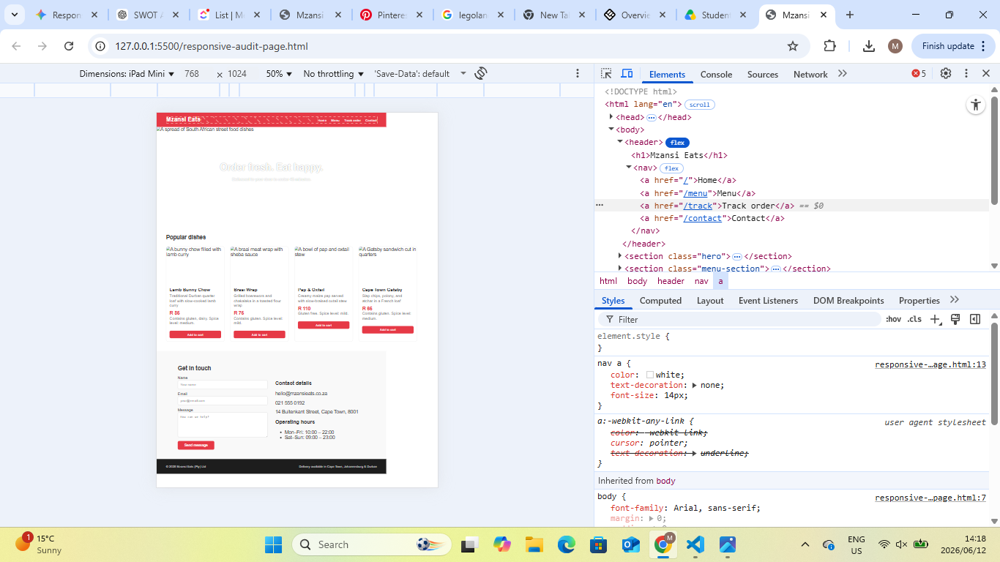
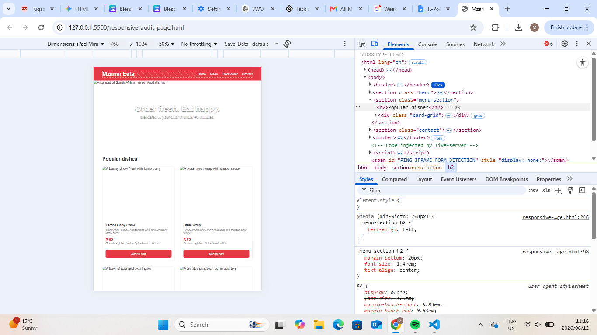
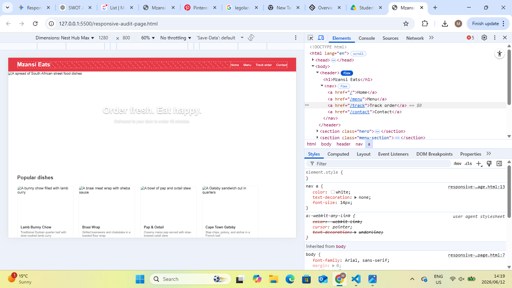
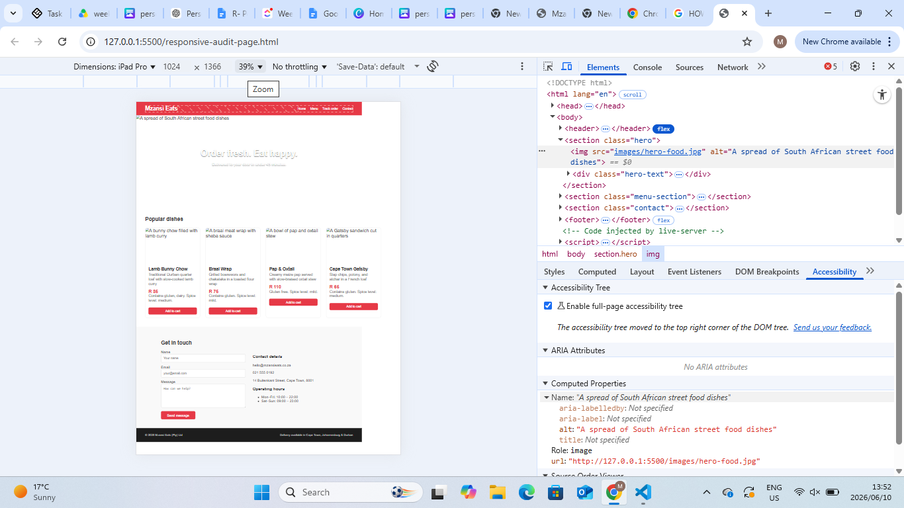

# Mzansi Eats: My Responsiveness Audit & Fixes Report

Hey! For this assignment, I went through the Mzansi Eats landing page to test how it handles different screen sizes. I used the device toolbar in Chrome DevTools to audit the layout at three specific breakpoints: **375px (Mobile)**, **768px (Tablet)**, and **1280px (Desktop)**.

Seeing the site on smaller viewports was a massive eye-opener. The layout completely broke down on mobile and tablet—elements were crashing into each other, content was getting clipped, and an ugly horizontal scrollbar appeared. I wanted to make sure our users get a smooth, painless experience whether they are ordering on their phones or checking us out from a desktop.

Below is my structured report detailing the issues I caught, how I tackled them, and the specific CSS changes I applied.

---

## 1. High-Level Summary of Layout Adjustments

| Section Evaluated       | The Issue on Small Screens                                                                                 | My Responsive Fix                                                                                                   |
| :---------------------- | :--------------------------------------------------------------------------------------------------------- | :------------------------------------------------------------------------------------------------------------------ |
| **Header Navigation**   | The logo and nav links crammed into each other on mobile, looking super cluttered.                         | Stacked them vertically on mobile so the layout can breathe, then let them spread back out on desktop.              |
| **Hero Image Banner**   | It was locked at a wide `1200px`, which pushed the viewport out and forced horizontal scrolling.           | Changed it to `width: 100%` and `height: auto` so it scales and fluidly shrinks on smaller screens.                 |
| **Popular Dishes Grid** | The grid was stuck showing 4 items side-by-side (`repeat(4, 250px)`), hiding most of the cards off-screen. | Set it to a single column on phones, 2 columns on tablets, and 4 columns on large monitors.                         |
| **Contact Wrapper**     | The inner container was hardcoded to `800px`, making it bleed past the screen boundaries on mobile.        | Changed it to a flexible `100%` width but kept a `max-width: 800px` boundary so it doesn't over-stretch on desktop. |
| **Contact Form Grid**   | The input fields and the address text were squished side-by-side into two tiny, unreadable columns.        | Made them stack vertically on mobile so users actually have space to type into the form fields.                     |

---

## 2. Detailed Breakdown of the 4 Main Issues & Fixes

### Issue 1: Hero Image Overflow (Horizontal Scrolling)

- **Breakpoints Affected:** Mobile (375px) & Tablet (768px)
- **What was wrong:** The top banner picture had a strict, fixed width of `1200px`. Because it couldn't adapt or shrink, it pushed the whole layout out of whack and forced a really annoying horizontal scrollbar on smaller viewports.
- **The Fix:** I removed that rigid width value from the CSS. Now it uses `width: 100%` so it fills the screen container beautifully, and I added a `min-height: 250px` so it doesn't look too flat or squished on phone screens.

#### My Testing Screenshots

- **Before Fix (Mobile 375px):** 
- **After Fix (Mobile 375px):** 

---

### Issue 2: Broken Menu Card Grid Layout

- **Breakpoints Affected:** Mobile (375px) & Tablet (768px)
- **What was wrong:** The menu section used a rigid grid setup: `grid-template-columns: repeat(4, 250px);`. This requires at least 1000px of screen space. On a phone, users could only see the very first card, and the other three delicious dishes were completely hidden off the edge of the screen.
- **The Fix:** I updated the default layout to a single vertical column (`1fr`) for mobile so users can just scroll down naturally. Then, I used media queries to bump it up to 2 columns on tablets and back to a clean 4-column layout on large desktop monitors.

#### My Testing Screenshots

- **Before Fix (Tablet 768px):** 
- **After Fix (Tablet 768px):** 

---

### Issue 3: Contact Form and Details Overlapping

- **Breakpoints Affected:** Mobile (375px)
- **What was wrong:** The contact section split the screen into two equal halves using `grid-template-columns: 1fr 1fr;`. On a narrow phone screen, dividing that tiny space in half made the form inputs and contact text completely crammed and impossible to read or interact with comfortably.
- **The Fix:** I changed the default layout to a single column (`1fr`). Now the form sits neatly on top of the address details on mobile, and it automatically snaps back into a side-by-side layout when the viewport hits tablet size and up.

#### My Testing Screenshots

- **Before Fix (Mobile 375px):** 
- **After Fix (Mobile 375px):** 

---

### Issue 4: Rigid Contact Inner Container

- **Breakpoints Affected:** Mobile (375px) & Tablet (768px)
- **What was wrong:** The `.contact-inner` wrapper was locked down with a firm `width: 800px;` property. Just like the hero image, this completely stopped the content from adapting or shrinking on any device narrower than 800px, breaking the page alignment.
- **The Fix:** I changed the style to `width: 100%` so the section scales down smoothly on mobile screens. I also added a `max-width: 800px` limit so it stops expanding on massive desktop setups and retains its original clean, centered look.

#### My Testing Screenshots

- **Before Fix (Tablet 768px):** 
- **After Fix (Tablet 768px):** 
